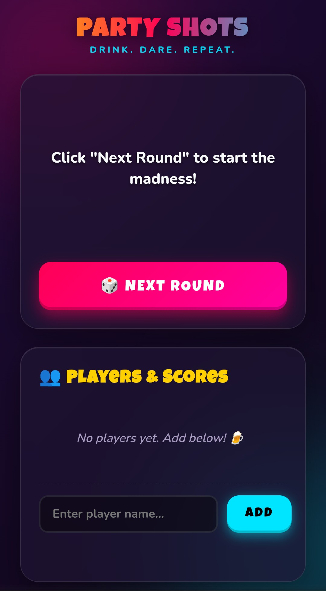
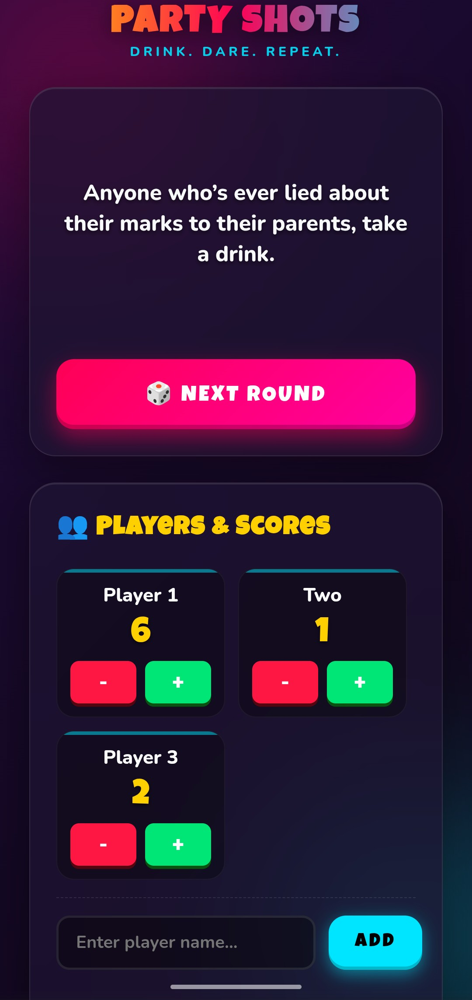

# 🍻 Party Shots

**[Play the game →](https://amolchourasia27.github.io/DrinkingGame/)**

A small party game for random prompts and quick score tracking. Open it on a phone, pass it around, or cast it to a bigger screen.

## Screenshots

  
  

## How to play

1. Add the players.
2. Tap **Next Round** for a random prompt.
3. Use **+** and **-** to track scores.

## Built with

Plain HTML, CSS, and JavaScript. No frameworks, no setup — just open and play.
